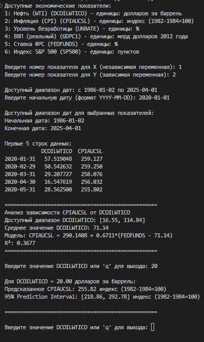
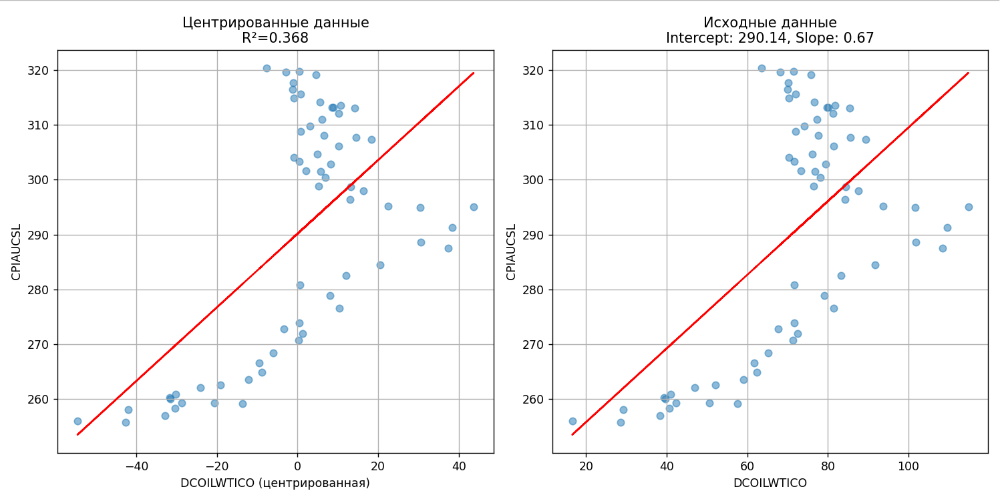

# FRED Data Analyzer

Программа для анализа линейных зависимостей между экономическими показателями из базы данных FRED (Federal Reserve Economic Data).



## Основные возможности

1. **Загрузка данных** напрямую из FRED API
2. **Построение регрессионных моделей** с автоматическим центрированием
3. **Визуализация** зависимостей
4. **Прогнозирование** с доверительными интервалами
5. **Поддержка** различных экономических показателей

## Установка

1. Убедитесь, что у вас установлен Python 3.8+
2. Установите зависимости:
```bash
pip install pandas numpy statsmodels scipy matplotlib fredapi PyQt5
```
3. Получите API ключ на FRED https://fred.stlouisfed.org/docs/api/api_key.html
4. Вставьте ключ в код:
```bash
fred = Fred(api_key='ваш_ключ_здесь')
```
5. Запустите программу:
```bash
python df5.py
```
## Особенности реализации

### Автоматическое центрирование данных:
- Переводит интерпретацию intercept к осмысленным значениям  
- Не влияет на качество прогнозов

### Интеллектуальная обработка данных:
- Автоматическое приведение к месячной частоте  
- Проверка доступных диапазонов дат  
- Обработка пропущенных значений  

### Расширяемая архитектура:
- Легко добавить новые показатели из FRED  
- Гибкая система единиц измерения  

## Математическая основа

Программа использует метод наименьших квадратов (OLS) с:
- Автоматическим расчетом стандартных ошибок  
- Доверительными интервалами на основе t-распределения  
- Центрированием предикторов:
```bash
y = b0 + b1*(x - mean(x))
```
